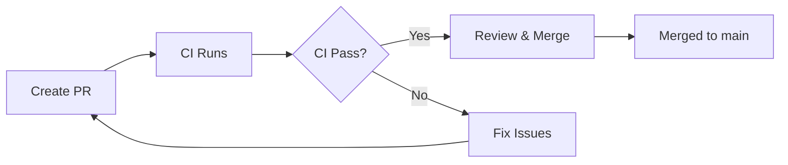
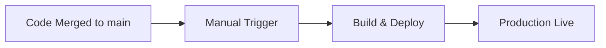

# GitHub Workflows Documentation

## Overview

This project uses two main workflows for Continuous Integration and Deployment:

## 1. CI Workflow (`ci.yml`)

**Trigger:** Automatically runs on:

- Pull requests to `main` or `develop` branches
- Direct pushes to `main` or `develop` branches

**Purpose:** Validate code quality, type safety, and build integrity

**Jobs:**

1. **Quality** - Code formatting and linting using Biome
2. **Type Check** - TypeScript type validation
3. **Build** - Production build verification
4. **Analyze** - Bundle size analysis (PR only)
5. **CI Success** - Summary job for status checks

**Key Features:**

- Parallel execution for speed
- Automatic Panda CSS generation via `prepare` script during `bun install`
- Biome unified quality checks (format + lint)
- Build artifact caching
- Bundle analysis on PRs

## 2. Deployment Workflow (`pages-deployment.yml`)

**Trigger:**

- **Manual dispatch** via GitHub Actions UI (recommended for production)
- Automatic on release publication (optional)

**Purpose:** Deploy to Cloudflare Pages using Direct Upload

**Configuration Required:**

### GitHub Secrets

```bash
CLOUDFLARE_API_TOKEN=<your-cloudflare-api-token>
CLOUDFLARE_ACCOUNT_ID=<your-cloudflare-account-id>
```

### GitHub Variables (optional)

```bash
CLOUDFLARE_PROJECT_NAME=my-site  # Default: my-site
SITE_URL=https://your-domain.com  # Default: https://my-site.pages.dev
```

**Deployment Flow:**

1. Checkout code
2. Install dependencies (with auto Panda CSS generation)
3. Build production site
4. Deploy to Cloudflare Pages
5. Create deployment summary

## Workflow Strategy

### Development Flow



### Deployment Flow



## Manual Deployment Steps

1. Go to **Actions** tab in GitHub
2. Select **Deploy to Cloudflare Pages** workflow
3. Click **Run workflow** button
4. Choose environment:
   - `production` - Deploy to production
   - `preview` - Deploy preview build
5. Click **Run workflow** to confirm

## Environment Variables

### Build Time (in `pages-deployment.yml`)

- `NODE_ENV=production` - Production build mode
- `SITE_URL` - Your site URL (optional, from GitHub Variables)

### Cloudflare Secrets

Configure these in GitHub Settings → Secrets and variables → Actions:

- `CLOUDFLARE_API_TOKEN` - Cloudflare API token with Pages deployment permission
- `CLOUDFLARE_ACCOUNT_ID` - Your Cloudflare account ID

## Key Improvements from Previous Setup

### Panda CSS Auto-Generation

- ✅ Removed manual `panda:gen` steps from workflows
- ✅ Now runs automatically via `prepare` script during `bun install`
- ✅ Cached `styled-system/` directory for faster builds

### Unified Quality Checks

- ✅ Single `biome ci` command instead of separate format/lint
- ✅ Parallel execution for speed
- ✅ Consistent behavior between local development and CI

### Manual Deployment Control

- ✅ Production deployments now require manual approval
- ✅ CI runs on PRs and pushes to main/develop branches, no auto-deploy on merge
- ✅ Cloudflare Direct Upload for faster deployments
- ✅ Environment selection (production/preview)

## Troubleshooting

### Panda CSS Not Generated

**Solution:** Make sure `prepare` script exists in `package.json`:

```json
"prepare": "lefthook install && panda codegen"
```

### Deployment Fails

1. Check GitHub Secrets are configured correctly
2. Verify Cloudflare API token has Pages deployment permission
3. Ensure `CLOUDFLARE_PROJECT_NAME` matches your Cloudflare Pages project

### CI Quality Checks Fail

- Run locally: `bun run ci:quality`
- Fix format issues: `bun run format`
- Fix lint issues: `bun run lint:fix`

## Local Development Commands

```bash
# Run full CI checks locally
bun run test:ci

# Quality checks only
bun run ci:quality

# Format code
bun run format

# Lint code
bun run lint

# Type check
bun run check:types

# Build for production
bun run build
```
